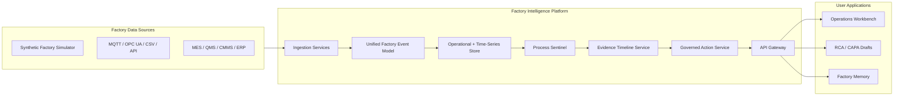

# Factory Intelligence Platform

**Open-source infrastructure for intelligent, connected, and AI-ready factories.**

Factory Intelligence Platform is the first major platform project from the **Open Factory Initiative**. It is designed to become a modular Factory Intelligence Layer that connects industrial data sources, normalizes factory events, detects quality/process drift, supports evidence-based investigations, and enables governed AI-assisted workflows across manufacturing operations.

> Status: early-stage open-source project. The first vertical slice is **Process Sentinel**, a quality drift and deviation intelligence workflow.

## What This Platform Does

The platform helps manufacturing teams answer questions such as:

- What is happening in the factory right now?
- Which process signals changed before quality drift appeared?
- Which work orders, assets, lines, materials, and batches are affected?
- What evidence supports a recommended containment action?
- What should a quality engineer review before approving action?
- What did the plant learn from similar prior incidents?

## MVP Vertical Slice

The first end-to-end MVP should be intentionally narrow:

```text
Synthetic Factory Simulator
→ Ingestion Worker
→ Factory Event Store / Unified Namespace
→ Process Sentinel Drift Detection
→ Evidence Timeline
→ Governed Recommendation Queue
→ Web UI Workbench
→ RCA / CAPA Draft Export
→ Factory Memory
```

## Target Architecture



## Suggested Initial Stack

This starter documentation assumes the initial implementation will use:

- **Backend:** Python + FastAPI
- **Frontend:** TypeScript + React / Next.js
- **Database:** PostgreSQL
- **Time-series patterns:** TimescaleDB-compatible schema design
- **Eventing:** MQTT-first local dev path; Kafka/Redpanda-compatible later
- **Testing:** Pytest, Playwright, contract tests, integration tests, and end-to-end tests
- **Documentation:** Markdown, Mermaid diagrams, ADRs, and contributor guides
- **AI workflows:** Human-approved recommendations with evidence and audit logs

These choices are intentionally open-source-friendly and practical for a Codex-assisted MVP.

## Repository Structure

Recommended structure:

```text
.
├── AGENTS.md
├── PLANS.md
├── CODE_REVIEW.md
├── README.md
├── CONTRIBUTING.md
├── SECURITY.md
├── SUPPORT.md
├── GOVERNANCE.md
├── ROADMAP.md
├── docs/
│   ├── START_HERE_FOR_CODEX.md
│   ├── ARCHITECTURE.md
│   ├── PRODUCT_REQUIREMENTS.md
│   ├── MVP_SCOPE.md
│   ├── DOMAIN_MODEL.md
│   ├── DATA_CONTRACTS.md
│   ├── DEVELOPMENT.md
│   ├── TESTING.md
│   ├── DOCUMENTATION.md
│   ├── LEARNING_MODE.md
│   ├── GOVERNED_ACTIONS.md
│   ├── UNIFIED_NAMESPACE.md
│   ├── OBSERVABILITY.md
│   ├── SECURITY_MODEL.md
│   └── decisions/
├── prompts/
│   ├── README.md
│   └── *.md
├── apps/
│   └── web/
├── services/
│   ├── api/
│   ├── ingestion/
│   ├── simulator/
│   └── process-sentinel/
├── packages/
│   ├── factory-events/
│   └── test-fixtures/
└── infra/
    └── docker/
```

## Current MVP Skeleton

The first executable skeleton now focuses on the simulator-backed Process
Sentinel workflow:

```text
services/simulator          Deterministic normal/drift/excursion events
packages/factory-events     Shared Pydantic event contracts
services/ingestion          Event validation, dead-letter handling, local storage
services/process-sentinel   Explainable drift rules, evidence, recommendations
services/api                FastAPI endpoints over stored MVP state
apps/web                    Placeholder for the future workbench
infra/docker                Local PostgreSQL configuration
```

The default developer loop uses JSONL files under `.local/` so contributors can
run tests without a database. PostgreSQL is included for the durable storage path
and initialized with the MVP schema.

## Local Setup

Prerequisites:

- Git
- Python 3.12+
- Make
- Docker Desktop or another Docker Compose-compatible runtime

Clone the repository and install the Python development environment:

```bash
git clone https://github.com/Open-Factory-Initiative/Factory-Intelligence-Platform.git
cd Factory-Intelligence-Platform
make setup
```

`make setup` creates a repo-local `.venv` and installs development dependencies
from `requirements-dev.txt`. The first run needs network access to PyPI unless
the packages are already available in your local pip cache.

If the repository is already cloned, run setup from the repository root:

```bash
make setup
```

Optional: create a local environment file from the checked-in template:

```bash
cp .env.example .env
```

The current backend skeleton does not require `.env` for the default JSONL path;
the template documents the local paths and future PostgreSQL configuration.

Run the simulator-backed Process Sentinel flow:

```bash
make simulate SCENARIO=gradual_drift
make ingest INPUT=.local/events/gradual_drift.jsonl
make sentinel-run
make api
```

Simulator scenarios can be selected with `SCENARIO=normal`,
`SCENARIO=gradual_drift`, or `SCENARIO=sudden_excursion`. Use `SEED`, `COUNT`,
`DURATION_MINUTES`, and `OUTPUT` to reproduce specific JSONL event streams; see
`services/simulator/README.md` for the full simulator workflow and ingestion
handoff.

Then open:

```text
http://127.0.0.1:8000/docs
```

Use `make api-reload` instead of `make api` when you want Uvicorn to watch files
and restart automatically during local development.

To start the optional local PostgreSQL service:

```bash
make dev-db
```

The default MVP commands still use JSONL storage under `.local/`; PostgreSQL is
present so durable storage work can evolve without changing the repo structure.

Run validation commands before opening a pull request:

```bash
make lint
make typecheck
make test
make test-unit
make test-integration
make test-contract
make test-e2e
```

`make test-e2e` is currently a placeholder because `apps/web` does not yet
contain the Next.js workbench.

## Working With Codex

Start here:

1. Read `docs/START_HERE_FOR_CODEX.md`.
2. Copy this documentation pack into the repository root.
3. Run Codex from the repository root.
4. Ask Codex to inspect the repo and produce a plan before creating code.
5. Run prompts in `prompts/` sequentially.
6. Require tests and docs for every meaningful change.

A good first Codex prompt is:

```text
Read AGENTS.md, PLANS.md, CODE_REVIEW.md, docs/START_HERE_FOR_CODEX.md, docs/ARCHITECTURE.md, docs/MVP_SCOPE.md, and docs/TESTING.md.

Do not write code yet. Inspect the repository and propose an execution plan for creating the initial Factory Intelligence Platform MVP skeleton. Include repo structure, first services, test strategy, and documentation updates. Ask me only for blockers that cannot be resolved from the docs.
```

## Contributing

New contributors should start with [CONTRIBUTING.md](./CONTRIBUTING.md). It
explains the project mission, local setup, issue workflow, branch naming, pull
request expectations, test commands, and how to find beginner-friendly work.

The current open-source foundation status is summarized in
[docs/PROJECT_FOUNDATION.md](./docs/PROJECT_FOUNDATION.md), including the files
that satisfy the foundation epic acceptance criteria.

## License

This project uses the repository license in `LICENSE`.
