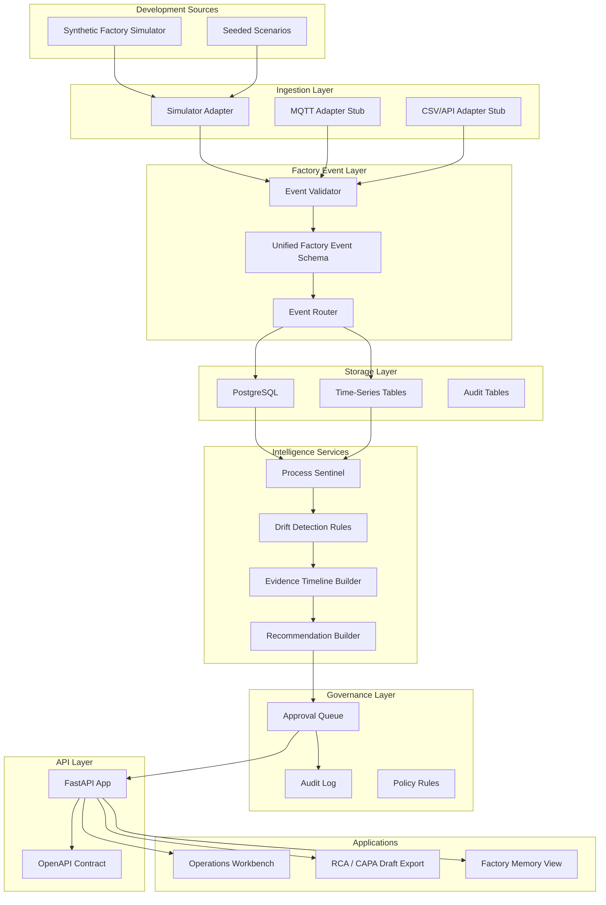
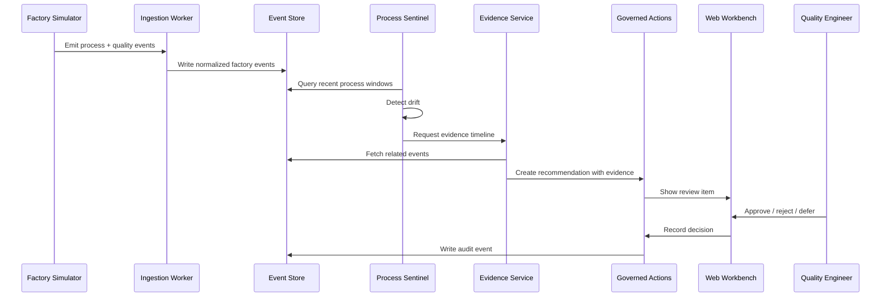
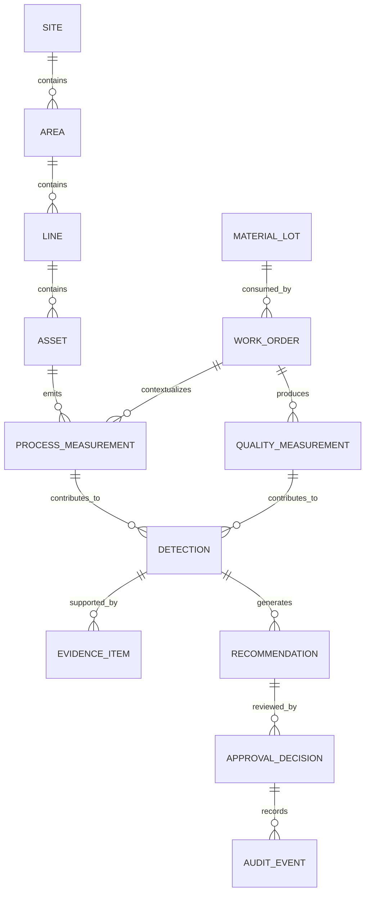
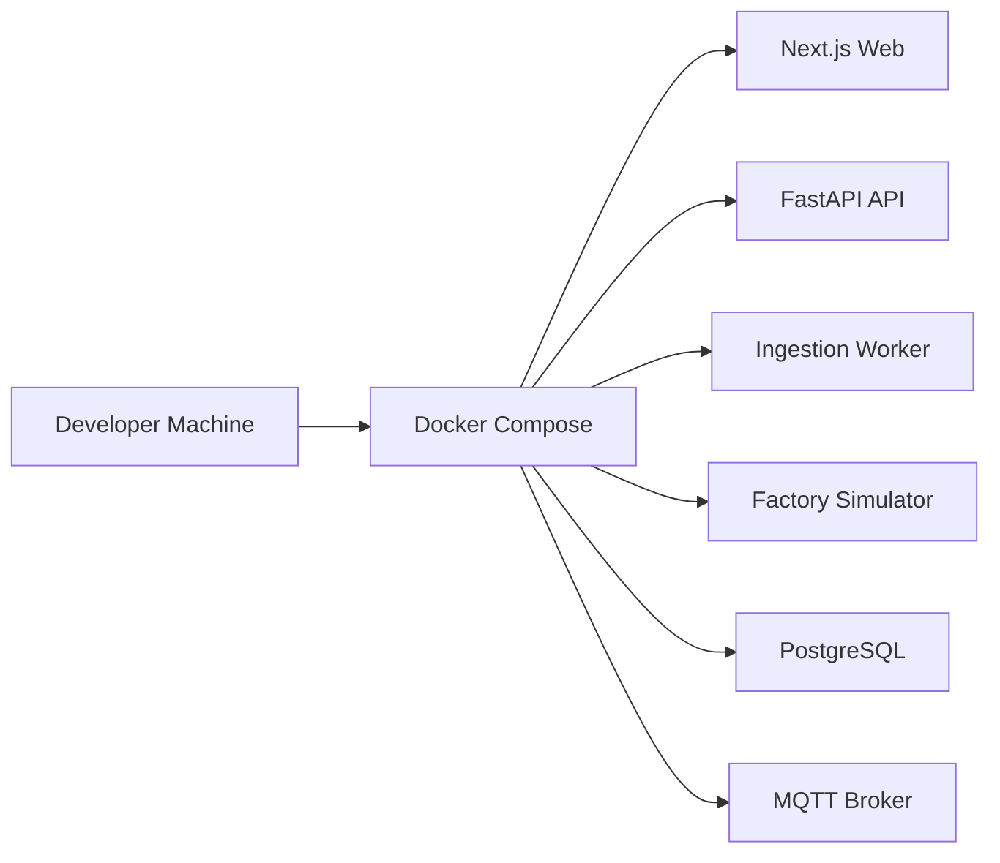

# Architecture

## Purpose

The Factory Intelligence Platform is an open-source Factory Intelligence Layer for manufacturing operations. It connects factory data, normalizes events, detects operational and quality risk, supports investigation workflows, and enables governed human-approved action.

The platform should be modular enough for contributors to use individual components while still supporting a complete end-to-end workflow.

## Architectural Goals

1. **Open-source and inspectable**
2. **Simulator-first development**
3. **Interoperable with industrial systems**
4. **Evidence-backed recommendations**
5. **Human-governed actions**
6. **Strong testing and documentation**
7. **Clear separation of concerns**
8. **Composable services**
9. **No direct real-world writeback in the MVP**
10. **Educational for contributors**

## MVP Architecture



## Long-Term Architecture

```mermaid
flowchart LR
    subgraph External["External Industrial Systems"]
        ERP["ERP"]
        MES["MES"]
        QMS["QMS"]
        CMMS["CMMS"]
        LIMS["LIMS"]
        SCADA["SCADA"]
        HIST["Historian"]
        OPC["OPC UA"]
        MQTT["MQTT"]
    end

    subgraph Connectors["Connector Layer"]
        AD["Adapters"]
        MAP["Mapping + Normalization"]
        VAL["Validation"]
    end

    subgraph UNS["Unified Namespace / Event Backbone"]
        TOPICS["Topic Model"]
        EVENTS["Factory Events"]
        STREAMS["Event Streams"]
    end

    subgraph Core["Core Platform Services"]
        ASSET["Asset Context"]
        ORDER["Work Order Context"]
        QUALITY["Quality Context"]
        MATERIAL["Material Context"]
        USER["User + Role Context"]
        AUDIT["Audit Context"]
    end

    subgraph Intelligence["Intelligence Layer"]
        SENT["Process Sentinel"]
        MAINT["Maintenance Intelligence"]
        SCHED["Schedule Risk"]
        MAT["Material Risk"]
        OPS["Operations Copilot"]
    end

    subgraph Governance["Governed Action Layer"]
        EVID["Evidence Service"]
        REC["Recommendation Service"]
        APPROVE["Approval Service"]
        ACTION["Action Dispatcher"]
        TRACE["Traceability + Audit"]
    end

    subgraph Experiences["User Experiences"]
        WORKBENCH["Factory Workbench"]
        MOBILE["Frontline Mobile"]
        API["Developer API"]
        REPORTS["Reports + Exports"]
    end

    External --> Connectors
    Connectors --> UNS
    UNS --> Core
    Core --> Intelligence
    Intelligence --> Governance
    Governance --> Experiences
```



## Core Architectural Layers

### 1. Source Layer

The source layer represents systems that produce data:

- Synthetic simulator
- MQTT brokers
- OPC UA servers
- MES APIs
- QMS APIs
- Historian APIs
- CSV uploads
- Manual notes

The MVP should start with the simulator and adapter stubs.

### 2. Ingestion Layer

The ingestion layer converts raw source data into candidate platform events.

Responsibilities:

- Read source data
- Apply source-specific mapping
- Validate required fields
- Attach source metadata
- Reject malformed messages
- Emit normalized events

### 3. Unified Factory Event Layer

The unified factory event model is the platform's central contract.

All services should exchange operational data using documented event schemas.

Core event categories:

- Asset telemetry event
- Process measurement event
- Quality measurement event
- Work order event
- Material event
- Deviation event
- Recommendation event
- Approval event
- Audit event

### 4. Storage Layer

The MVP can use PostgreSQL with schema patterns that support:

- Relational context
- Time-series measurements
- Event history
- Recommendation state
- Approval state
- Audit history

Do not prematurely optimize with too many databases.

### 5. Intelligence Layer

The intelligence layer interprets factory state.

MVP intelligence should be simple and explainable:

- Rolling averages
- Control limits
- Threshold rules
- Drift indicators
- Correlation windows
- Evidence scoring

Avoid opaque ML until the deterministic workflow is working.

### 6. Evidence Layer

The evidence layer explains why the system believes something matters.

Evidence should include:

- Signal names
- Values
- Time windows
- Baselines
- Deviations from baseline
- Related work orders
- Related quality results
- Related assets/materials
- Similar prior incidents when available

### 7. Governed Action Layer

The governed action layer converts detections into recommendations that humans can approve, reject, or defer.

This layer must never silently perform high-impact action.

Recommendation states:

```text
draft
proposed
needs_review
approved
rejected
deferred
executed
closed
```

### 8. API Layer

The API layer exposes platform capabilities to the UI and future integrations.

MVP API groups:

- `/health`
- `/events`
- `/assets`
- `/work-orders`
- `/quality`
- `/sentinel/detections`
- `/sentinel/evidence`
- `/recommendations`
- `/approvals`
- `/reports`

### 9. Application Layer

The MVP UI should provide:

- Factory overview
- Active detections
- Evidence timeline
- Recommendation review
- Approval/rejection workflow
- RCA/CAPA draft view
- Learning log / incident memory

## Process Sentinel Flow



## MVP Service Boundaries

### `services/simulator`

Generates synthetic factory data.

Should support:

- Assets
- Lines
- Work orders
- Process measurements
- Quality measurements
- Drift scenarios
- Seeded deterministic test scenarios

### `services/ingestion`

Receives data and normalizes events.

Should support:

- Simulator ingestion
- Event validation
- Error handling
- Dead-letter style logging
- Contract tests

### `services/api`

Serves UI and integration endpoints.

Should support:

- Health check
- Event query
- Detection query
- Evidence query
- Recommendation review
- Report draft endpoints

### `services/process-sentinel`

Detects process and quality drift.

Should support:

- Deterministic rule engine
- Configurable thresholds
- Evidence window construction
- Recommendation creation
- Unit tests for every rule

### `apps/web`

Provides user-facing workbench.

Should support:

- Dashboard
- Detection list
- Evidence timeline
- Recommendation approval workflow
- RCA/CAPA draft preview

### `packages/factory-events`

Shared event schemas and fixtures.

Should support:

- Schema definitions
- Validators
- Sample events
- Contract tests

## Data Flow Rules

1. Raw source data must not flow directly to UI.
2. Services should use normalized event contracts.
3. Recommendations must cite evidence.
4. Approvals must create audit events.
5. Simulator data must be clearly labeled.
6. Every external input must be validated.

## Suggested Domain Model



## Deployment Architecture For Local Development



## Production Direction

Production deployment is out of scope for the first MVP, but the architecture should not block it.

Future deployment should support:

- Containerized services
- Environment-specific config
- Secrets management
- Observability
- Role-based access
- Tenant isolation
- Connector isolation
- Audit retention
- Safe action dispatch policies

## Architecture Decision Records

Use `docs/decisions/` for major decisions.

Create an ADR when changing:

- Primary language/framework
- Service boundaries
- Storage design
- Event schema
- Governance model
- Test strategy
- Deployment model
- Security model
