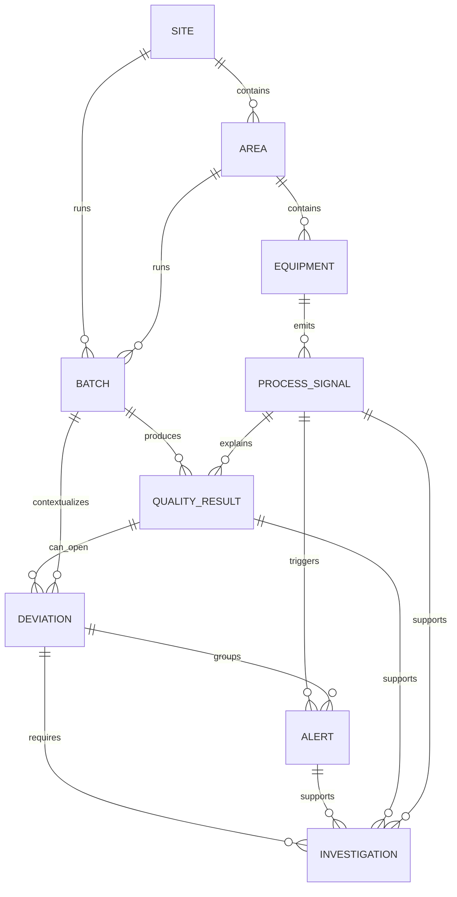

# Domain Model

## Overview

The first MVP domain model describes the minimum manufacturing context needed
for a future Process Sentinel quality drift agent. It is intentionally small:
one site, one area, a few equipment records, process signals, a batch, quality
results, a deviation, an alert, and an investigation.

The current implementation lives in:

```text
services/api/factory_api/domain.py
```

The API exposes deterministic demo data so contributors can build UI and
Process Sentinel workflows without connecting to real plant systems.

## Entities

### Site

A manufacturing location.

Fields:

- `site_id`
- `name`
- `timezone`
- `description`

### Area

A functional area inside a site.

Fields:

- `area_id`
- `site_id`
- `name`
- `description`

### Equipment

A physical machine, cell, or process unit.

Fields:

- `equipment_id`
- `area_id`
- `name`
- `equipment_type`
- `criticality`

### ProcessSignal

A named measurement emitted by equipment or a process.

Fields:

- `signal_id`
- `equipment_id`
- `name`
- `unit`
- `normal_min`
- `normal_max`

### Batch

A production batch or execution context.

Fields:

- `batch_id`
- `site_id`
- `area_id`
- `product_name`
- `status`
- `started_at`
- `ended_at`

### QualityResult

A quality measurement for a batch. It links back to the process signals that
may explain the result.

Fields:

- `quality_result_id`
- `batch_id`
- `measurement_name`
- `value`
- `unit`
- `spec_min`
- `spec_max`
- `result`
- `related_signal_ids`
- `recorded_at`

### Deviation

A quality or process exception requiring investigation.

Fields:

- `deviation_id`
- `batch_id`
- `quality_result_id`
- `title`
- `severity`
- `status`
- `related_signal_ids`
- `opened_at`

### Alert

A platform-visible warning about an active condition. Alerts can point to a
deviation once one has been opened.

Fields:

- `alert_id`
- `deviation_id`
- `batch_id`
- `signal_id`
- `title`
- `severity`
- `status`
- `triggered_at`

### Investigation

A human investigation that groups the deviation, alerts, quality results, and
process signals needed for review.

Fields:

- `investigation_id`
- `deviation_id`
- `title`
- `status`
- `owner`
- `alert_ids`
- `quality_result_ids`
- `related_signal_ids`
- `opened_at`

## Relationships



## Demo Data

The current demo context uses:

- `greenville_demo_site` / Greenville Demo Site
- `packaging_area` / Packaging Area
- `line_2` / Line 2
- `filler_f_201` / Filler F-201
- `checkweigher_cw_201` / Checkweigher CW-201
- `ofi_demo_beverage` / OFI Demo Beverage
- `WO-DEMO-1007`
- `fill_weight`
- `filler_nozzle_pressure`
- `BATCH-DEMO-1007`
- `qr_fill_weight_WO_DEMO_1007`
- `dev_fill_weight_drift_WO_DEMO_1007`
- `alert_fill_weight_trend_WO_DEMO_1007`
- `inv_fill_weight_drift_WO_DEMO_1007`

This data intentionally mirrors the simulator-backed Process Sentinel scenario:
fill weight trends upward, the related quality result fails the upper
specification, a deviation is opened, and the investigation links the quality
outcome back to the process signals.

## API Access

Read-only MVP endpoints expose list and detail access:

```text
GET /sites
GET /sites/{site_id}
GET /areas
GET /areas/{area_id}
GET /equipment
GET /equipment/{equipment_id}
GET /process-signals
GET /process-signals/{signal_id}
GET /batches
GET /batches/{batch_id}
GET /quality-results
GET /quality-results/{quality_result_id}
GET /deviations
GET /deviations/{deviation_id}
GET /alerts
GET /alerts/{alert_id}
GET /investigations
GET /investigations/{investigation_id}
```

The investigation detail endpoint returns the investigation plus its linked
deviation, alerts, quality results, and process signals. No write endpoints or
industrial actions are added in this MVP model.

## Status Values

### Batch Status

- `planned`
- `running`
- `completed`
- `held`
- `released`

### Deviation Status

- `open`
- `under_investigation`
- `closed`

### Alert Status

- `active`
- `acknowledged`
- `closed`

### Investigation Status

- `open`
- `in_review`
- `closed`
