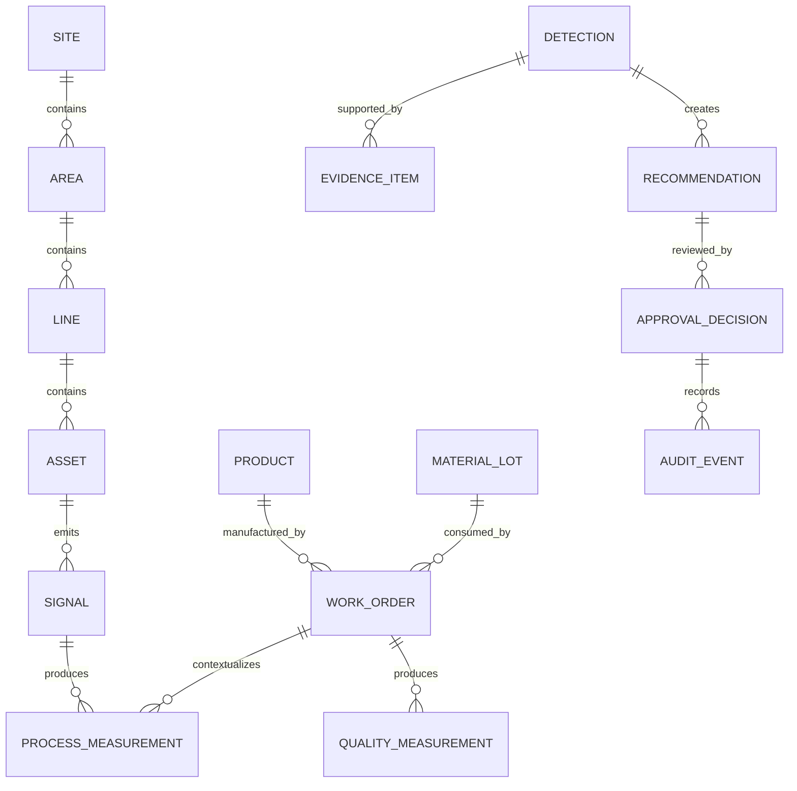

# Domain Model

## Overview

The domain model describes the core manufacturing concepts used by the Factory Intelligence Platform.

The MVP should use a small but realistic domain model. Avoid modeling every possible manufacturing concept at the beginning.

## Entities

### Site

A manufacturing location.

Fields:

- `site_id`
- `name`
- `timezone`
- `description`

### Area

A functional area within a site.

Fields:

- `area_id`
- `site_id`
- `name`
- `description`

### Line

A production line within an area.

Fields:

- `line_id`
- `area_id`
- `name`
- `description`

### Asset

A physical machine, cell, process unit, or equipment item.

Fields:

- `asset_id`
- `line_id`
- `name`
- `asset_type`
- `criticality`

### Signal / Tag

A named measurement emitted by an asset or process.

Fields:

- `signal_id`
- `asset_id`
- `name`
- `unit`
- `data_type`
- `normal_min`
- `normal_max`

### Work Order

A production order or batch execution context.

Fields:

- `work_order_id`
- `product_id`
- `line_id`
- `status`
- `planned_start`
- `planned_end`
- `actual_start`
- `actual_end`

### Product

A manufactured product or SKU.

Fields:

- `product_id`
- `name`
- `revision`
- `quality_specs`

### Material Lot

A lot of input material used in production.

Fields:

- `material_lot_id`
- `material_name`
- `supplier`
- `received_at`
- `status`

### Process Measurement

A time-stamped process value.

Fields:

- `event_id`
- `timestamp`
- `site_id`
- `line_id`
- `asset_id`
- `signal_id`
- `work_order_id`
- `value`
- `unit`
- `quality`
- `source`

### Quality Measurement

A time-stamped quality result.

Fields:

- `event_id`
- `timestamp`
- `site_id`
- `line_id`
- `work_order_id`
- `product_id`
- `measurement_name`
- `value`
- `unit`
- `spec_min`
- `spec_max`
- `result`

### Detection

A platform-generated finding indicating drift, excursion, or risk.

Fields:

- `detection_id`
- `detection_type`
- `severity`
- `status`
- `created_at`
- `time_window_start`
- `time_window_end`
- `summary`
- `confidence`
- `related_work_order_id`
- `related_asset_ids`

### Evidence Item

A specific piece of evidence supporting a detection.

Fields:

- `evidence_id`
- `detection_id`
- `evidence_type`
- `timestamp`
- `title`
- `description`
- `source_event_ids`
- `score`

### Recommendation

A proposed human-reviewed action.

Fields:

- `recommendation_id`
- `detection_id`
- `status`
- `recommended_action`
- `rationale`
- `risk_level`
- `requires_approval`
- `created_at`

### Approval Decision

A human decision on a recommendation.

Fields:

- `approval_id`
- `recommendation_id`
- `reviewer`
- `decision`
- `reason`
- `created_at`

### Audit Event

An immutable record of important platform activity.

Fields:

- `audit_event_id`
- `timestamp`
- `actor`
- `action`
- `entity_type`
- `entity_id`
- `details`

## Relationships

## Status Values

### Work Order Status

- `planned`
- `running`
- `paused`
- `completed`
- `cancelled`

### Detection Status

- `new`
- `investigating`
- `recommendation_created`
- `acknowledged`
- `closed`
- `false_positive`

### Recommendation Status

- `draft`
- `proposed`
- `needs_review`
- `approved`
- `rejected`
- `deferred`
- `executed`
- `closed`

### Approval Decision

- `approved`
- `rejected`
- `deferred`
- `needs_more_evidence`

## Modeling Guidance

Keep the model small until the MVP works.

Do not add entities unless:

- They are needed by the MVP workflow
- They improve traceability
- They are required for evidence
- They are required for governance
- They are required for tests
